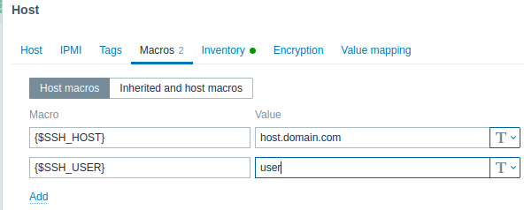

A Zabbix template for monitoring Borg backup repositories. Requires Borg binary to be available in the system being monitored. Monitoring occurs on the backup server, though is possible to have the backup server check remote repositories via SSH for services such as rsync.net.

In this documentation, there are multiple references to Local and Remote repositories. Just to be clear, Local repos are ones located on the server that the zabbix-agent is running on. Remote repos are ones where the borg repo is located on a different server than the zabbox-agent that will be doing the monitoring.

# How it works
This plugin assumes that you have taken your backup and placed it in a local or remote folder.

Once that is complete, you need to run the `cron-scripts/borg-check.sh` script. This script will run a `borg info` to get data on the current size of your repository as well as `borg check` to check the integrity of the data in the repo. The check command can be very time consuming so for testing, you may want to comment it out.

The script takes 2 parameters.

Usage: `cron-scripts/borg-check.sh <remote|local> <path-to-status.txt-file>`
 - *<remote|local>* - is the repo a local repo or a remote repo over ssh
 - *<path-to-status.txt-file>* - path to the status file inside the repo. Use an absolute path

 **Example:** `/etc/cron.d/borg-check.sh local /data/home/borg/status.txt`
 
 **Example:** `/etc/cron.d/borg-check.sh remote user@server.domain.com:/data/home/borg/status.txt`

This script will populate a status.txt file inside the repo folder. This is true for both local and remote repositories. Below is a sample of what the status.txt file will be populated with:
```
Archive name: Public-2023-06-14
Archive fingerprint: 16-----------------------------------------04ba8d
Comment: 
Hostname: borg-server
Username: borg
Time (start): Wed, 2023-06-14 02:54:56
Time (end): Wed, 2023-06-14 03:01:09
Duration: 6 minutes 13.66 seconds
Number of files: 122989
Command line: /usr/bin/borg create /home/borg/folder/servername::Public-2023-06-14 /mnt/FileServer/Public
Utilization of maximum supported archive size: 0%
------------------------------------------------------------------------------
                       Original size      Compressed size    Deduplicated size
This archive:              124.26 GB             97.47 GB              6.86 MB
All archives:                7.45 TB              5.84 TB             84.76 GB

                       Unique chunks         Total chunks
Chunk index:                  127216              9737602
Starting repository check
Starting repository index check
Index object count match.
Completed repository check, no problems found.
Starting archive consistency check...
Analyzing archive Public-2023-04-16 (1/60)
...
...
Analyzing archive Public-2023-06-14 (60/60)
Archive consistency check complete, no problems found.
```

Zabbix will now parse this file using the UserParameters in `zabbix_agentd.d/borg.conf` to collect the data.

All of the collected data will be placed in your Zabbix host assuming you have the templated added.

# Installation
## General Steps
1. Copy `zabbix_agentd.d/borg.conf` to the Zabbix agent's configuration directory (usually located at `/etc/zabbix`). If using unencrypted repositories, be sure to read the cronjob scripts and uncomment line needed.
2. Open the `zabbix_agentd.d/borg.conf` file and on the first line you will need to edit the part that says `/home/*/*/README` to be wherever your README files are located for your borg repos.
   - For remote repositories, you will need to change the `/home/borg/*/*/README` line a bit lower down.
   - Absolute paths are required.
	- Incase you are not aware, each borg repo contains a README file by default. The Zabbix discovery item uses this file to discover new repositories.
3. Import template configuration `templates/borg.xml` to Zabbix web frontend.
   - Importing the borg4.xml template will actually import both the local and remote templates.
   - At this time, the borg62.xml file is experimental.
4. Restart the zabbix-agent service with the command `sudo systemctl restart zabbix-agent.service` or `sudo systemctl restart zabbix-agent2.service`
5. In the web interface, add the template that you imported to your host.

## Additional Steps for Remote Repositories
1. You will need to make sure that the zabbix user on the system has their ssh key configured as an authorized user on the remote system. You can do this by entering the following commands:
   - `sudo mkdir -p /var/lib/zabbix/.ssh && sudo chown zabbix:zabbix /var/lib/zabbix/.ssh`
   - `sudo -u zabbix ssh-keygen -t rsa -b 4096 -C "your_email@example.com" -f /var/lib/zabbix/.ssh/id_rsa`
   - `cat /var/lib/zabbix/.ssh/id_rsa.pub | ssh user@host.rsync.net 'dd of=.ssh/authorized_keys oflag=append conv=notrunc'`
   - `ssh-keyscan host.rsync.net | sudo -u zabbix tee --append /var/lib/zabbix/.ssh/known_hosts`
2. The templates expect the following MACROs to be setup in the host that will be doing the monitoring. These can be setup in the web interface of Zabbix.
   - {$SSH_USER} - This is the user portion of an ssh string **user**@server.domain.com
   - {$SSH_HOST} - This is the host portion of an ssh string user@**host.domain.com**
3. Change the zabbix user's home dir to be /var/lib/zabbix/
   - `usermod -d /var/lib/zabbix/ zabbix`



# Notes
This plugin uses discovery capabilities provided by Zabbix to locate backup repositories. Since all commands are executed by `zabbix` user, appropriate permissions must be granted to all backup repositories.

The `borg check` command in the cron scripts can be time consuming so I typically run those during the day when the backup server is not doing anything.
